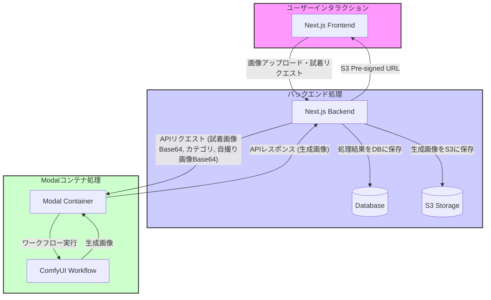

# Clotify ドキュメント(ComfyUI)

## 概要

このドキュメントでは、Clothifyで行われる衣服・アクセサリの試着画像を生成するためのComfyUIのフローを説明します。
開発者・AIの閲覧用に作成されています。

### 技術スタック

- Modal ([https://modal.com/](https://modal.com/)) - ComfyUIをサーバーレスで実行するためのサービス [[docs](https://modal.com/docs)]
- ComfyUI ([https://github.com/ComfyUI/ComfyUI](https://github.com/ComfyUI/ComfyUI)) - 主に画像生成機能を主とするノードベースのwebUI

### ファイル構成

```plaintext
modal_scripts
├── comfyapp.py
│　　# modalのコンテナにデプロイするためのコード
├── comfyui-flow.md
│　　# このドキュメント
├── memory_snapshot_helper
│　　# メモリスナップショットを使用するためのカスタムノード
├── test-api.py
│　　# テスト用のAPIコード
└── workflow_api.json
    # comfyUIからエクスポートしたAPI用のワークフロー
```

### フロー

#### 1. Next.jsのbackendからModalのコンテナにAPIリクエストを送信

- リクエストの内容はJSON形式
- リクエストの内容は以下の通り
  - 試着する服・アクセサリの画像データ(Base64)
  - 試着する服・アクセサリのカテゴリ
  - 自撮り画像データ(Base64)

#### 2. Modalのコンテナでは、APIリクエストを受け取ったら、以下の処理を行う

- リクエストの内容を元に、ComfyUIのワークフローを実行
- 生成された画像をAPIリクエストのレスポンスとして返す

#### 3. Next.jsのbackendでは、ModalのコンテナからAPIリクエストのレスポンスを受け取ったら、以下の処理を行う

- レスポンスのデータをS3に保存し、
- 保存した画像のURLをNext.jsのfrontendに返す
- DBに結果をまとめて、共有できるようにする。

### フローの図


